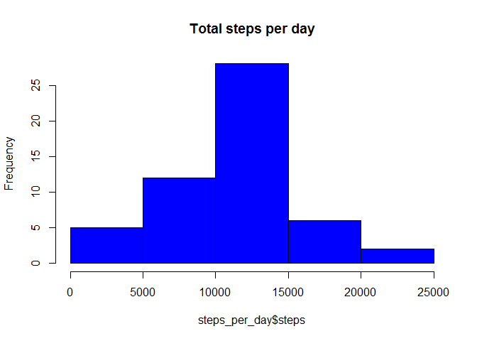
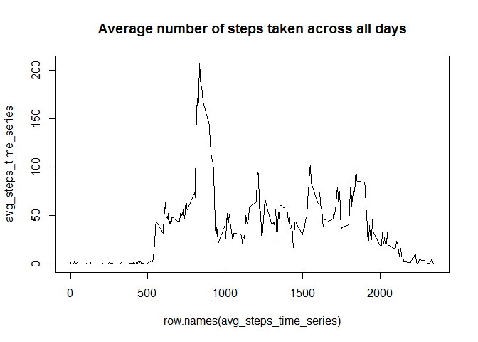
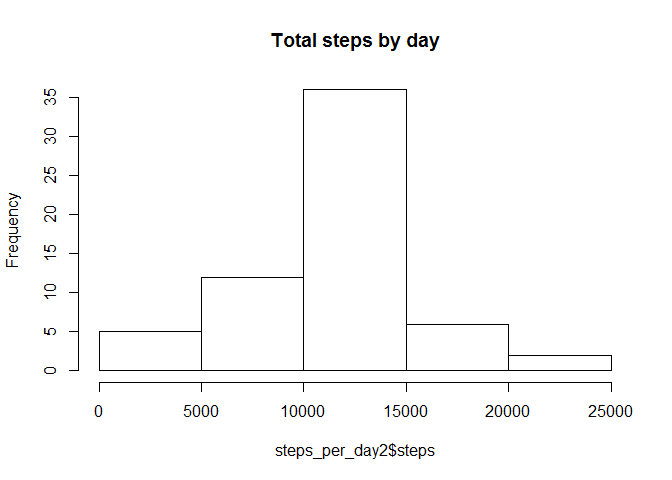

Assignment\_1
================
Aya Abdelmonem

Welcome to Reproducable Research Assignment\_1
----------------------------------------------

Here we are reading file into R and store data into new variable.

``` r
Activity_data <- read.csv("C:/Users/dell/Desktop/myDataScienceWork/reproducable research/Reproducable_research_assignment_1/RepData_PeerAssessment1/activity/activity.csv")
```

We can take a look about these data and collect basic information about it .

``` r
summary(Activity_data)
```

    ##      steps                date          interval     
    ##  Min.   :  0.00   2012-10-01:  288   Min.   :   0.0  
    ##  1st Qu.:  0.00   2012-10-02:  288   1st Qu.: 588.8  
    ##  Median :  0.00   2012-10-03:  288   Median :1177.5  
    ##  Mean   : 37.38   2012-10-04:  288   Mean   :1177.5  
    ##  3rd Qu.: 12.00   2012-10-05:  288   3rd Qu.:1766.2  
    ##  Max.   :806.00   2012-10-06:  288   Max.   :2355.0  
    ##  NA's   :2304     (Other)   :15840

We can determine the first six rows in the dataset.

``` r
head(Activity_data)
```

    ##   steps       date interval
    ## 1    NA 2012-10-01        0
    ## 2    NA 2012-10-01        5
    ## 3    NA 2012-10-01       10
    ## 4    NA 2012-10-01       15
    ## 5    NA 2012-10-01       20
    ## 6    NA 2012-10-01       25

To count the steps per day in Activity dataset

``` r
steps_per_day <- aggregate(steps ~ date, data = Activity_data, sum, na.rm = TRUE)
```

To plot the total steps per day

``` r
hist(steps_per_day$steps, main = "Total steps per day", col = "blue")
```



Mean value of total steps per day is :

``` r
mean(steps_per_day$steps)
```

    ## [1] 10766.19

Median value of total steps per day is :

``` r
median(steps_per_day$steps)
```

    ## [1] 10765

To get the average of daily activity pattern ,

Make a time series plot (i.e. type = "l") of the 5-minute interval (x-axis) and the average number of steps taken, averaged across all days (y-axis)

``` r
avg_steps_time_series <- tapply(Activity_data$steps, Activity_data$interval, mean, na.rm = TRUE)
```

Plotting time series for daily activity pattern

``` r
plot(row.names(avg_steps_time_series), avg_steps_time_series, type = "l", main = "Average number of steps taken across all days")
```



We can determine the maximum number of steps of daily activity pattern :

``` r
which.max(avg_steps_time_series)
```

    ## 835 
    ## 104

To Impute missing values, we collect the total numebr of NA'S in dataset rows

``` r
missing_values <- sum(is.na(Activity_data))
missing_values
```

    ## [1] 2304

This is a strategy to fill all the missing values in the dataset create a new dataset

``` r
Activity_data2 <- Activity_data
```

``` r
StepsAverage <- aggregate(steps ~ interval, data = Activity_data, FUN = mean)

fillNA <- numeric()

for (i in 1:nrow(Activity_data)) {
  
    obs <- Activity_data[i, ]
    
    if (is.na(obs$steps)) {
      
        steps <- subset(StepsAverage, interval == obs$interval)$steps
        
    }
    
    else 
      {
    
        steps <- obs$steps
      }
    
    fillNA <- c(fillNA, steps)
}
```

And now ! we will fill the missing data in the new data set :

``` r
Activity_data2$steps <- fillNA
```

Then we will calculate the total number of steps per day but with the new dataset calles activity\_data2 which missing values filled in .

``` r
steps_per_day2 <- aggregate(steps ~ date, data = Activity_data2, sum, na.rm = TRUE)
```

plotting the total numebr of steps per day with the new data set

``` r
hist(steps_per_day2$steps, main = "Total steps by day")
```



The mean of steps per day for the new dataset is :

``` r
mean(steps_per_day2$steps)
```

    ## [1] 10766.19

The median of steps per day for the new dataset is :

``` r
median(steps_per_day2$steps)
```

    ## [1] 10766.19

This final plot will shows the Activity patterns in weekdays and weekends . First we will determine the days wheather at the weekend or weekdays.

``` r
library(lattice)

Sys.setlocale("LC_ALL","English")
```

    ## [1] "LC_COLLATE=English_United States.1252;LC_CTYPE=English_United States.1252;LC_MONETARY=English_United States.1252;LC_NUMERIC=C;LC_TIME=English_United States.1252"

``` r
dates<- as.Date(Activity_data$date)
days<-weekdays(dates)
Day_Identifier <- vector()

for (i in 1:nrow(Activity_data)) {
  
    if (days[i] == "Saturday")
      {
      
        Day_Identifier[i] <-"Weekend"
      }
  
  else if (days[i] == "Sunday")
    {
    
        Day_Identifier[i] <- "Weekend"
    }
  
  else
    
    {
    
        Day_Identifier[i] <- "Weekday"
    }
}
Activity_data$Day_Identifier <- Day_Identifier
Activity_data$Day_Identifier<- factor(Activity_data$Day_Identifier)

days_steps_identifiers <- aggregate(steps ~ interval + Day_Identifier, data = Activity_data, mean)
names(days_steps_identifiers) <- c("interval", "Day_Identifier", "steps")

xyplot(steps ~ interval | Day_Identifier, days_steps_identifiers, type = "l", layout = c(1, 2), 
    xlab = "Interval", ylab = "Number of steps")
```


